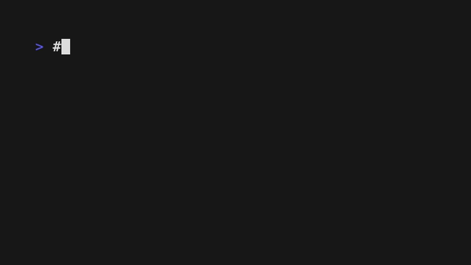

# fuse

A local firewall for AI agent commands.

[](https://github.com/php-workx/fuse/actions/workflows/ci.yml)
[](https://go.dev/)
[](LICENSE)

<picture>
  <source media="(prefers-color-scheme: dark)" srcset="assets/hero.gif">
  <source media="(prefers-color-scheme: light)" srcset="assets/hero-light.gif">
  
</picture>

**Status: public beta**

| | Status |
|---|--------|
| Platforms | macOS, Linux |
| Claude Code | primary integration |
| Codex CLI | beta |
| Windows | early-adopter testing |

---

AI coding agents run shell commands on your machine. Without a safety layer,
a single bad command can delete your files, data, or cloud resources before
you notice.

Fuse sits between your AI agent and your shell. It classifies every command
into SAFE, CAUTION, APPROVAL, or BLOCKED, then applies your selected profile to
decide when risky commands need review. No cloud, no API keys, everything local.

## Install

```bash
# macOS
brew install php-workx/tap/fuse

# Debian/Ubuntu
curl -sSfL https://github.com/php-workx/fuse/releases/latest/download/fuse_amd64.deb -o fuse.deb
sudo dpkg -i fuse.deb

# Fedora/RHEL
curl -sSfL https://github.com/php-workx/fuse/releases/latest/download/fuse_amd64.rpm -o fuse.rpm
sudo rpm -i fuse.rpm

# Alpine
curl -sSfL https://github.com/php-workx/fuse/releases/latest/download/fuse_amd64.apk -o fuse.apk
sudo apk add --allow-untrusted fuse.apk

# Windows PowerShell
irm https://raw.githubusercontent.com/php-workx/fuse/main/install.ps1 | iex

# From source (requires Go 1.25+)
go install github.com/php-workx/fuse/cmd/fuse@latest
```

## Try it

```bash
# Enable fuse (ships disabled by default)
fuse enable

# Block a dangerous command
echo '{"tool_name":"Bash","tool_input":{"command":"rm -rf /"}}' | fuse hook evaluate 2>&1
# => fuse:POLICY_BLOCK STOP. Recursive force-remove of root, home, or variable path ...

# Safe commands pass silently (exit 0, no output)
echo '{"tool_name":"Bash","tool_input":{"command":"ls -la"}}' | fuse hook evaluate 2>&1

# Integrate with your agent
fuse install claude    # or: fuse install codex
fuse doctor            # verify the setup (prints hook binary path + build info;
                       # warns if the binary on PATH is stale)
```

See [docs/QUICKSTART.md](docs/QUICKSTART.md) for the full walkthrough, including
how to [recognize and fix a stale hook binary](docs/QUICKSTART.md#detecting-a-stale-hook-binary).

## What fuse is

- A classification and gating layer for shell commands and MCP tool calls
- A local-only tool with zero network dependencies
- A guardrail that catches obvious mistakes before they execute
- Configurable via YAML policy with per-tag rule overrides
- Observable via TUI dashboard (`fuse monitor`), event log, and stats

## What fuse is not

- **Not a sandbox** — hook mode has a TOCTOU window (the agent executes after fuse allows)
- **Not a replacement for OS-level security** (seccomp, AppArmor, containers)
- **Not infallible** — classification is heuristic and regex-based
- **Not a monitoring daemon** — it runs per-invocation, not as a background service

See [docs/TRUST_MODEL.md](docs/TRUST_MODEL.md) for the full security model, threat
boundaries, and what fuse touches on your filesystem.

## What fuse touches

| What | Where | Purpose |
|------|-------|---------|
| Config | `~/.fuse/config/config.yaml` | User settings |
| Policy | `~/.fuse/config/policy.yaml` | Custom classification rules |
| State DB | `~/.fuse/state/fuse.db` | Event log, approvals (SQLite) |
| HMAC secret | `~/.fuse/state/secret.key` | Approval record signing |
| Claude hook | `~/.claude/settings.json` | Adds `PreToolUse` hook entries |
| Codex config | `~/.codex/config.toml`, `~/.codex/hooks.json` | Adds native Bash hook when supported, otherwise fuse-shell MCP server |

**Network:** None. Fuse makes zero network calls. The optional [LLM judge](docs/TRUST_MODEL.md)
invokes locally-installed CLI tools which may make their own API calls.

## Uninstall

```bash
# Remove integrations from Claude Code and Codex
fuse uninstall

# Also remove all fuse state (~/.fuse/)
fuse uninstall --purge

# Temporarily disable (zero processing, instant pass-through)
fuse disable

# Re-enable
fuse enable
```

> `fuse uninstall` removes integrations and optionally `~/.fuse/`. It does not
> remove the binary itself. To fully remove: `fuse uninstall --purge && rm $(which fuse)`

## Updating

Agent hooks invoke the `fuse` binary resolved from `PATH`, so to pick up new
classification rules or bug fixes you must reinstall the binary — restarting
your agent is not enough.

```bash
# From source
go install github.com/php-workx/fuse/cmd/fuse@latest

# Homebrew
brew upgrade php-workx/tap/fuse

# Verify the hook will run the new build
fuse doctor
```

`fuse doctor` reports the resolved hook binary path and — when the PATH binary
matches the running build — its version. For a different (unverified) PATH
binary, it reports the SHA-256 hash and file size instead of executing it. It
warns with `[ WARN ] fuse binary in PATH` when the PATH binary drifts from the
build you ran `doctor` with. The same warning is emitted by `fuse install
claude` and `fuse install codex`. See
[docs/QUICKSTART.md](docs/QUICKSTART.md#detecting-a-stale-hook-binary) for the
full output and fix workflow.

## Why fuse?

**Why not just use Claude Code's built-in approval prompts?**
Claude Code asks before running some commands, but the rules are opaque and not
configurable. Fuse gives you explicit YAML policy, per-tag overrides, event
logging, and a TUI dashboard.

**Why not a shell wrapper or alias?**
Shell wrappers don't intercept MCP tool calls. Fuse works at the hook and MCP
protocol level, covering both shell commands and tool invocations.

**Why not a container or VM?**
Containers are heavy and break agent workflows that need filesystem access. Fuse
is a lightweight guardrail that runs alongside the agent, not a sandbox.

<details>
<summary><strong>Integration details</strong></summary>

### Claude Code

```bash
fuse install claude           # basic hook (Bash + MCP)
fuse install claude --secure  # + file tool path checks + recommended Claude settings
```

### Codex CLI

```bash
fuse install codex
```

Uses Codex native Bash hooks when supported by the installed Codex CLI, with an
automatic fallback to the fuse-shell MCP server on older versions or Windows.

### MCP proxy

Configure downstream servers in `~/.fuse/config/config.yaml`:

```yaml
mcp_proxies:
  - name: aws-mcp
    command: npx
    args: ["-y", "@aws/mcp-server"]
```

```bash
fuse proxy mcp --downstream-name aws-mcp
```

### Manual run mode

```bash
fuse run --timeout 5m -- "terraform destroy prod"
```

### Observability

```bash
fuse monitor              # TUI dashboard with live events + approval
fuse events --limit 20    # recent events
fuse stats                # decision/agent/workspace breakdown
```

</details>

<details>
<summary><strong>Development</strong></summary>

```bash
just setup       # install tools + configure git hooks
just dev         # full local quality gate (fmt, vet, lint, test, vuln, semgrep, budgets)
just pre-commit  # fast checks only
just test        # tests with race detector + coverage
```

See [CONTRIBUTING.md](CONTRIBUTING.md) for details.

</details>

## License

[MIT](LICENSE)
